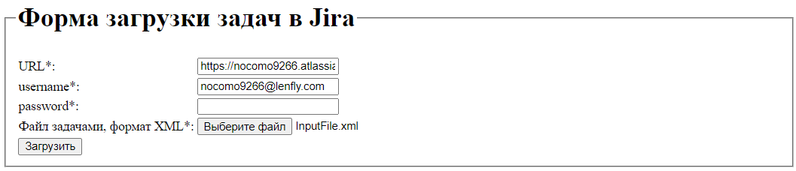

# IssueToJira 

Java приложение (maven проект, spring boot), 
создания задач в Jira на основе исходных данных в XML файле.

## Запуск приложения
1. `git clone https://github.com/savadevel/IssuesToJira`
2. `cd IssuesToJira`
3. `mvnw package`
4. `java -jar ./target/IssuesToJira-1.0.0.jar`

## Использование приложения
При локальном запуске, Приложение доступно по адресу [http://localhost:7070](http://localhost:7070). При переходе 
по указанному адресу открывается страница "Форма загрузки задач в Jira", все поля обязательны для заполнения:



Учетные данные для проверки (действительны на 11.07.2022):
* URL: https://nocomo9266.atlassian.net
* username: nocomo9266@lenfly.com
* password: xZnscYftBkE7D7tRgYhX6530
* Файл с задачами, формат XML, см. InputFile.xml

По результатам работы Приложения выводится отчет по загрузке задач в Jira, с указанием ключа задачи в Jira


При ошибках выводится страница с указанием ошибки / ошибок


Ход работы приложения пишется в лог файл ./log/issues_to_jira.log

Приложение не создает проект, оно находит его в Jira по projectKey, указанному в XML файле, см. ниже.
Т.е. требуется предварительно создать проект с тем же ключом в Jira.

XML файл содержит информацию (имя, приоритет и тип) о задачах в проекте,
которые нужно создать, имеет следующую структуру:

```xml
<data>
    <projectKey>PR</projectKey>
    <issues>
        <issue>
            <id>1</id>
            <type>task</type>
            <priority>Highest</priority>
        </issue>
        <issue>
            <id>2</id>
            <type>task</type>
            <priority>Highest</priority>
        </issue>
        <issue>
            <id>3</id>
            <type>task</type>
            <priority>Highest</priority>
        </issue>
    </issues>
    <descriptions>
        <description>
            <id>1</id>
            <summary>Task case 1</summary>
        </description>
        <description>
            <id>2</id>
            <summary>Task case 2</summary>
        </description>
        <description>
            <id>3</id>
            <summary>Task case 3</summary>
        </description>
    </descriptions>
</data>
```

*XML файл имеет следующие особенности, которые необходимо учитывать:*

* тегом projectKey задается ключ проекта задач
* элементы summary находятся в отдельном теге, и связаны с тегом issue через id
* входные файлы валидируются по XSD схеме